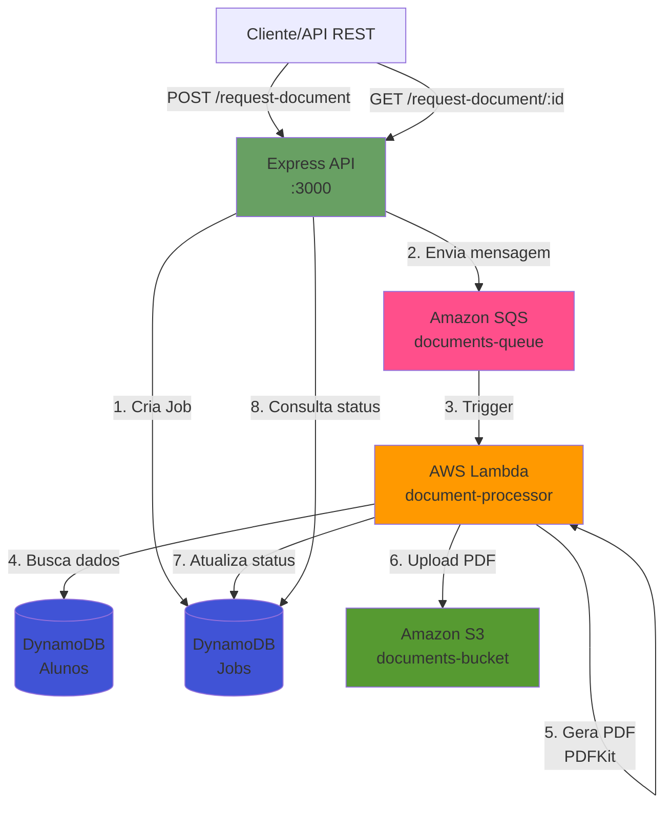
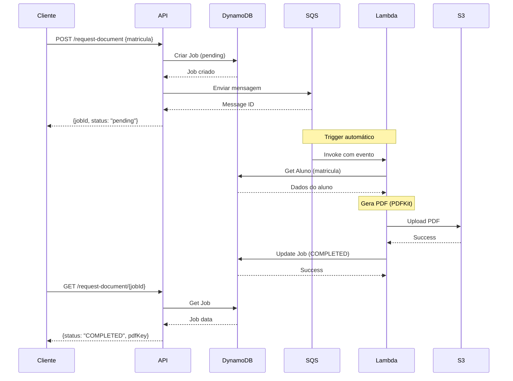
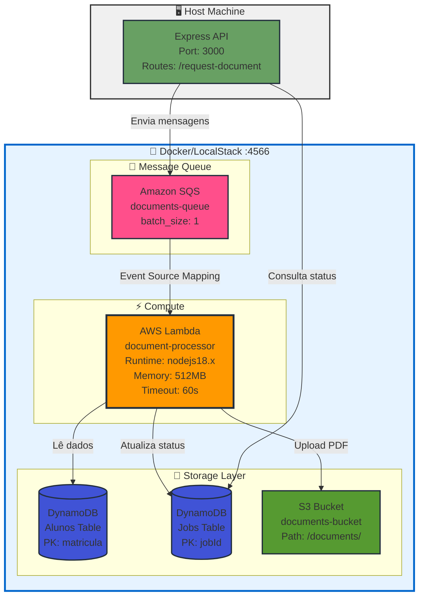

# 🎨 Visualização do Diagrama de Arquitetura

## 📊 Diagrama Principal (Mermaid)

O diagrama de arquitetura está embutido no [README.md](README.md) usando **Mermaid**, que o GitHub renderiza automaticamente.

### Como Visualizar

#### No GitHub

1. Acesse o repositório no GitHub
2. O README.md renderizará o diagrama automaticamente
3. Cores e ícones são aplicados automaticamente

#### Localmente (VS Code)

1. Instale a extensão **Markdown Preview Mermaid Support**
2. Abra o README.md
3. Use `Ctrl+Shift+V` para preview

#### Online (Mermaid Live Editor)

1. Acesse: https://mermaid.live/
2. Cole o código abaixo:



---

## 🎯 Versão Simplificada (ASCII)

Para apresentações em terminal ou documentos plain text:

```
┌─────────────┐
│   Cliente   │
│   (HTTP)    │
└──────┬──────┘
       │ POST /request-document
       ▼
┌─────────────┐      ┌──────────────┐
│  Express    │──1──▶│  DynamoDB    │
│    API      │      │     Jobs     │
│   :3000     │      └──────────────┘
└──────┬──────┘
       │ 2. Envia mensagem
       ▼
┌─────────────┐
│   Amazon    │
│     SQS     │
│    Queue    │
└──────┬──────┘
       │ 3. Trigger
       ▼
┌─────────────┐      ┌──────────────┐
│   Lambda    │──4──▶│  DynamoDB    │
│  Processor  │      │    Alunos    │
└──────┬──────┘      └──────────────┘
       │
       │ 5. Gera PDF
       ▼
    [PDFKit]
       │
       │ 6. Upload
       ▼
┌─────────────┐
│   Amazon    │
│     S3      │
│   Bucket    │
└─────────────┘
       │
       │ 7. Update status
       ▼
┌─────────────┐
│  DynamoDB   │
│    Jobs     │
│  (COMPLETED)│
└─────────────┘
```

---

## 🔄 Diagrama de Sequência

Para visualizar o fluxo temporal:



---

## 🏗️ Diagrama de Infraestrutura

### Versão Mermaid (Renderiza no GitHub)



### Versão ASCII (Para Terminal/Documentos)

```
┌────────────────────────────────────────────────────┐
│              Docker Host (LocalStack)              │
│                                                    │
│  ┌──────────────────────────────────────────────┐ │
│  │           Amazon SQS                         │ │
│  │     documents-queue                          │ │
│  │     batch_size: 1                            │ │
│  └────────────┬─────────────────────────────────┘ │
│               │ Event Source Mapping              │
│               ▼                                    │
│  ┌──────────────────────────────────────────────┐ │
│  │     AWS Lambda Function                      │ │
│  │     Name: document-processor                 │ │
│  │     Runtime: nodejs18.x                      │ │
│  │     Memory: 512MB                            │ │
│  │     Timeout: 60s                             │ │
│  │     Env: AWS_ENDPOINT, BUCKET_NAME           │ │
│  └──────────────────────────────────────────────┘ │
│               │                                    │
│       ┌───────┼───────┐                           │
│       ▼       ▼       ▼                            │
│  ┌─────┐ ┌─────┐ ┌─────┐                        │
│  │ DB  │ │ DB  │ │ S3  │                        │
│  │Alunos│ │Jobs │ │Docs │                       │
│  └─────┘ └─────┘ └─────┘                        │
└────────────────────────────────────────────────────┘

┌────────────────────────────────────────────────────┐
│              Host Machine                          │
│                                                    │
│  ┌──────────────────────────────────────────────┐ │
│  │          Express API                         │ │
│  │          Port: 3000                          │ │
│  │          Routes: /request-document           │ │
│  └──────────────────────────────────────────────┘ │
└────────────────────────────────────────────────────┘
```

---

## 📸 Exportar Diagrama como Imagem

### Opção 1: Mermaid CLI

```bash
npm install -g @mermaid-js/mermaid-cli
mmdc -i diagram.mmd -o diagram.png
```

### Opção 2: Online

1. Acesse https://mermaid.live/
2. Cole o código Mermaid
3. Clique em "Download PNG/SVG"

### Opção 3: No GitHub

1. GitHub renderiza automaticamente
2. Use screenshot tool (Win+Shift+S)

---

## 🎨 Cores Utilizadas

| Componente | Cor         | Hex     | Significado          |
| ---------- | ----------- | ------- | -------------------- |
| Lambda     | Laranja     | #FF9900 | AWS Lambda oficial   |
| SQS        | Rosa        | #FF4F8B | AWS SQS oficial      |
| DynamoDB   | Azul        | #4053D6 | AWS DynamoDB oficial |
| S3         | Verde       | #569A31 | AWS S3 oficial       |
| API        | Verde Claro | #68A063 | Express.js           |

---

## 📱 Para Apresentações

### PowerPoint/Google Slides

- Use screenshot do diagrama renderizado no GitHub
- Adicione animações nos passos numerados
- Destaque cada serviço AWS com cores oficiais

### Notion/Confluence

- Importe o código Mermaid diretamente
- Ambos suportam renderização nativa

### PDF

- Export do GitHub como imagem
- Ou use Mermaid Live Editor para exportar SVG

---

<div align="center">

**Diagrama desenvolvido para máxima clareza em entrevistas técnicas**

</div>
