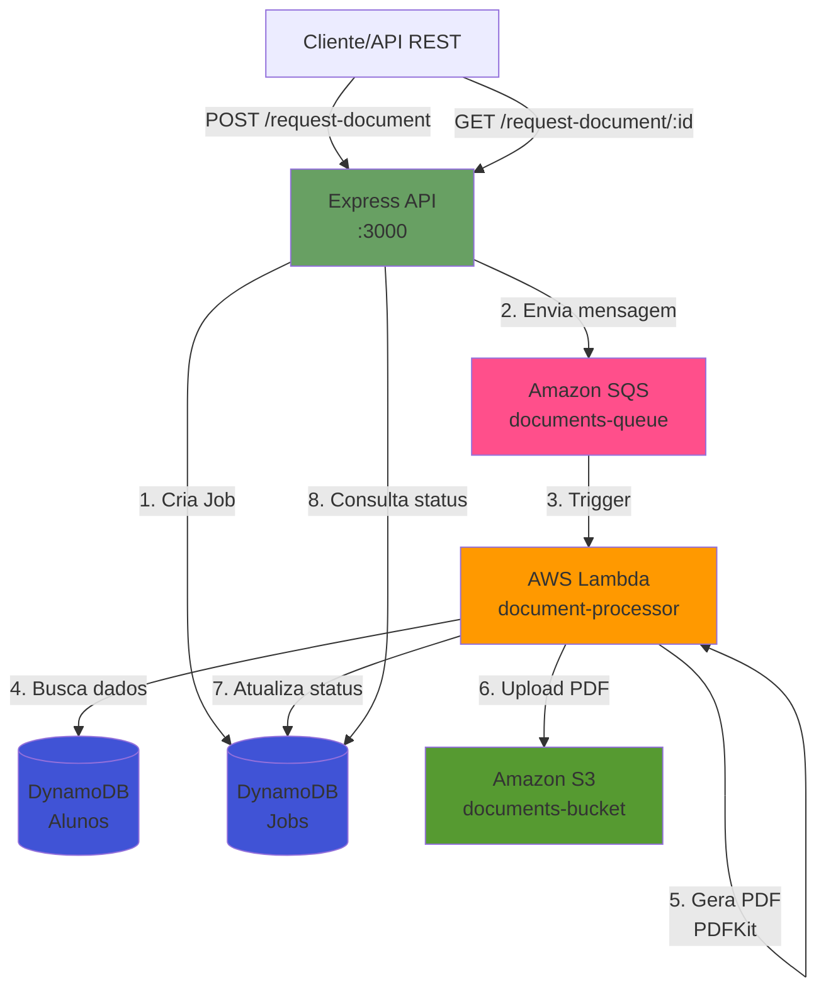

# 📄 AWS Serverless Document Processing System

> **Sistema serverless completo** para processamento assíncrono de documentos PDF utilizando arquitetura AWS moderna, desenvolvido com LocalStack para simulação local.

<div align="center">

[](https://nodejs.org/)
[](https://www.typescriptlang.org/)
[](https://localstack.cloud/)
[](https://www.docker.com/)
[](LICENSE)

</div>

---

## 🎯 Sobre o Projeto

Sistema de **arquitetura event-driven** que demonstra boas práticas de desenvolvimento serverless na AWS. O projeto simula um fluxo completo de processamento de documentos acadêmicos, desde a requisição até a geração e armazenamento de PDFs, utilizando serviços gerenciados AWS.

**Ideal para:** Portfólio profissional, estudos de arquitetura serverless, proof of concept e testes de integração.

### ✨ Diferenciais Técnicos

- ✅ **Arquitetura Event-Driven** com SQS triggers
- ✅ **Processamento assíncrono** escalável via Lambda
- ✅ **PDF gerado em memória** (zero dependência de filesystem)
- ✅ **Type-safe** com TypeScript end-to-end
- ✅ **Infraestrutura como código** com Docker Compose
- ✅ **Testes locais** com LocalStack (zero custo AWS)
- ✅ **Pronto para produção** (basta trocar endpoints)

---

## 🏗️ Arquitetura do Sistema



### 📊 Fluxo de Processamento

1. **Cliente** envia requisição HTTP com matrícula do aluno
2. **API** cria registro no DynamoDB (status: `pending`)
3. **API** publica mensagem na fila SQS
4. **SQS** aciona a Lambda automaticamente
5. **Lambda** atualiza status para `PROCESSING`
6. **Lambda** busca dados do aluno no DynamoDB
7. **Lambda** gera PDF em memória usando PDFKit
8. **Lambda** faz upload do PDF para S3
9. **Lambda** atualiza status para `COMPLETED` com chave do PDF
10. **Cliente** consulta status via GET endpoint

---

## 🚀 Tecnologias Utilizadas

### Backend & Runtime
- **Node.js 18.x** - Runtime JavaScript moderno
- **TypeScript 5.9** - Type safety e melhor DX
- **Express.js** - Framework web minimalista

### AWS Services (LocalStack)
- **Lambda** - Função serverless (nodejs18.x, 512MB, 60s timeout)
- **SQS** - Fila de mensagens para processamento assíncrono
- **DynamoDB** - Banco NoSQL para dados de alunos e jobs
- **S3** - Object storage para PDFs gerados

### Libraries & Tools
- **PDFKit** - Geração de PDF em memória
- **AWS SDK v2** - Integração com serviços AWS
- **Docker & Docker Compose** - Containerização
- **LocalStack 4.14.1** - Simulação AWS local
- **PowerShell** - Scripts de automação

---

## 📸 Demonstração

### Exemplo de Requisição
```bash
POST http://localhost:3000/request-document
Content-Type: application/json

{
  "matricula": "1001"
}
```

### Resposta Imediata
```json
{
  "jobId": "e7a4b8b4-b915-4959-9a67-7b6a8a03fbca",
  "status": "pending"
}
```

### Consulta de Status (após ~3 segundos)
```bash
GET http://localhost:3000/request-document/e7a4b8b4-b915-4959-9a67-7b6a8a03fbca
```

### Resposta Final
```json
{
  "matricula": "1001",
  "jobId": "e7a4b8b4-b915-4959-9a67-7b6a8a03fbca",
  "status": "COMPLETED",
  "pdfKey": "documents/e7a4b8b4-b915-4959-9a67-7b6a8a03fbca.pdf",
  "completedAt": "2026-02-28T19:54:38.313Z"
}
```

---

## ⚡ Quick Start

### Pré-requisitos
```bash
node --version    # 18.x ou superior
docker --version  # Docker Desktop instalado
aws --version     # AWS CLI v2
```

### 1. Clone e instale dependências
```bash
git clone <seu-repositorio>
cd pucrs-docs-simulate

# Lambda
cd lambda && npm install && cd ..

# API
cd api && npm install && cd ..
```

### 2. Inicie o ambiente LocalStack
```bash
docker-compose up -d
```

### 3. Configure recursos AWS (uma vez)
```bash
powershell -ExecutionPolicy Bypass -File setup-all.ps1
```

Este script cria automaticamente:
- ✅ Bucket S3: `documents-bucket`
- ✅ Tabela DynamoDB: `Alunos` (3 registros de teste)
- ✅ Tabela DynamoDB: `Jobs` (tracking)
- ✅ Fila SQS: `documents-queue`
- ✅ Lambda: `document-processor` + trigger

### 4. Inicie a API
```bash
cd api
npm run dev
```

### 5. Teste a aplicação
Use Thunder Client, Postman ou curl:

```bash
# Criar job
curl -X POST http://localhost:3000/request-document \
  -H "Content-Type: application/json" \
  -d '{"matricula":"1001"}'

# Aguarde 3-5 segundos

# Verificar status
curl http://localhost:3000/request-document/{jobId}
```

---

## 📁 Estrutura do Projeto

```
pucrs-docs-simulate/
├── api/                           # REST API (Express.js)
│   ├── src/
│   │   └── server.ts             # Endpoints e configuração
│   ├── package.json
│   └── tsconfig.json
│
├── lambda/                        # Função Lambda
│   ├── src/
│   │   └── index.ts              # Handler principal + PDF generator
│   ├── build-and-zip.ps1         # Script de build Windows
│   ├── package.json
│   └── tsconfig.json
│
├── localstack/                    # Scripts de deployment
│   ├── deploy-lambda.ps1         # Deploy função Lambda
│   ├── setup-resources.ps1       # Criar recursos AWS
│   └── init.sh                   # Inicialização LocalStack
│
├── data/
│   └── alunos.json               # Dados de teste (3 alunos)
│
├── docker-compose.yml            # Definição LocalStack
├── setup-all.ps1                 # Setup completo automatizado
└── README.md                     # Este arquivo
```

---

## 🔧 Configuração Avançada

### Variáveis de Ambiente (Lambda)
```bash
AWS_ENDPOINT=http://host.docker.internal:4566
BUCKET_NAME=documents-bucket
```

> **⚠️ Importante:** Use `host.docker.internal` para que a Lambda (em container) acesse o LocalStack no host.

### Comandos Úteis

```bash
# Ver logs da Lambda em tempo real
docker logs -f $(docker ps -q -f "ancestor=public.ecr.aws/lambda/nodejs:18")

# Verificar PDFs gerados
aws s3 ls s3://documents-bucket/documents/ --endpoint-url http://localhost:4566

# Listar jobs processados
aws dynamodb scan --table-name Jobs --endpoint-url http://localhost:4566

# Rebuild Lambda após mudanças
cd lambda
npm run build
cd ../localstack
.\deploy-lambda.ps1
```

---

## 📊 Dados de Teste

| Matrícula | Nome | Curso |
|-----------|------|-------|
| `1001` | João Silva | Engenharia de Software |
| `1002` | Maria Souza | Design Digital |
| `1003` | Pedro Lima | Administração |

---

## 🎓 Conceitos Demonstrados

### Arquitetura & Padrões
- ✅ **Event-Driven Architecture** - Desacoplamento via mensageria
- ✅ **Serverless Computing** - Escalabilidade automática
- ✅ **Async Processing** - Processamento não-bloqueante
- ✅ **Queue-Based Load Leveling** - Controle de fluxo
- ✅ **CQRS Light** - Separação comando/query

### Boas Práticas AWS
- ✅ **IAC (Infrastructure as Code)** - Reprodutibilidade
- ✅ **Least Privilege** - Permissões mínimas necessárias
- ✅ **Idempotency** - Processamento seguro de mensagens
- ✅ **Monitoring & Logging** - Observabilidade detalhada
- ✅ **Error Handling** - Tratamento robusto de falhas

### DevOps & Development
- ✅ **Local Development** - Testes sem custo AWS
- ✅ **Type Safety** - TypeScript end-to-end
- ✅ **Containerization** - Docker para consistência
- ✅ **Scripted Deployment** - Automação completa

---

## 🚀 Deploy em Produção (AWS Real)

Para migrar para AWS em produção:

1. **Remover endpoint LocalStack**
```typescript
// Remover do código:
endpoint: 'http://host.docker.internal:4566'
```

2. **Criar recursos via CloudFormation/Terraform**
```bash
# Exemplo com Terraform
terraform init
terraform plan
terraform apply
```

3. **Deploy da Lambda**
```bash
aws lambda update-function-code \
  --function-name document-processor \
  --zip-file fileb://lambda/lambda.zip \
  --region us-east-1
```

4. **Configurar API Gateway** (substituir Express API)

---

## 🔍 Troubleshooting

### Lambda fica em timeout?
✅ Verifique que `AWS_ENDPOINT=http://host.docker.internal:4566`

### "Cannot find module 'index'"?
✅ Rebuild Lambda: `cd lambda && npm run build`

### Status fica "pending" indefinidamente?
✅ Verifique trigger SQS:
```bash
aws lambda list-event-source-mappings \
  --function-name document-processor \
  --endpoint-url http://localhost:4566
```

---

## 🎯 Próximas Melhorias

- [ ] Implementar Dead Letter Queue (DLQ)
- [ ] Adicionar AWS X-Ray para tracing
- [ ] CloudWatch Metrics e Alarms
- [ ] API Gateway com autenticação Cognito
- [ ] Step Functions para workflows complexos
- [ ] S3 Event Notifications
- [ ] Testes unitários e E2E
- [ ] CI/CD com GitHub Actions

---

## 📜 Licença

Este projeto está sob a licença MIT. Veja [LICENSE](LICENSE) para mais detalhes.

---

## 👨‍💻 Autor

**Luan P.**  
Estudante PUCRS | Desenvolvedor Backend | AWS Enthusiast

<div align="center">

[](https://linkedin.com/in/seu-perfil)
[](https://github.com/seu-usuario)

**Desenvolvido como demonstração de competências em arquitetura serverless AWS**

</div>

---

<div align="center">

### ⭐ Se este projeto foi útil, considere dar uma estrela!

**Status do Projeto:** ✅ Completo e Funcional | **Última Atualização:** Fevereiro 2026

</div>
